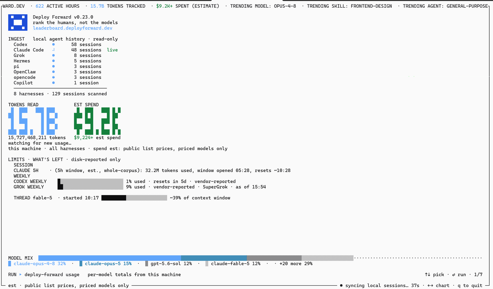
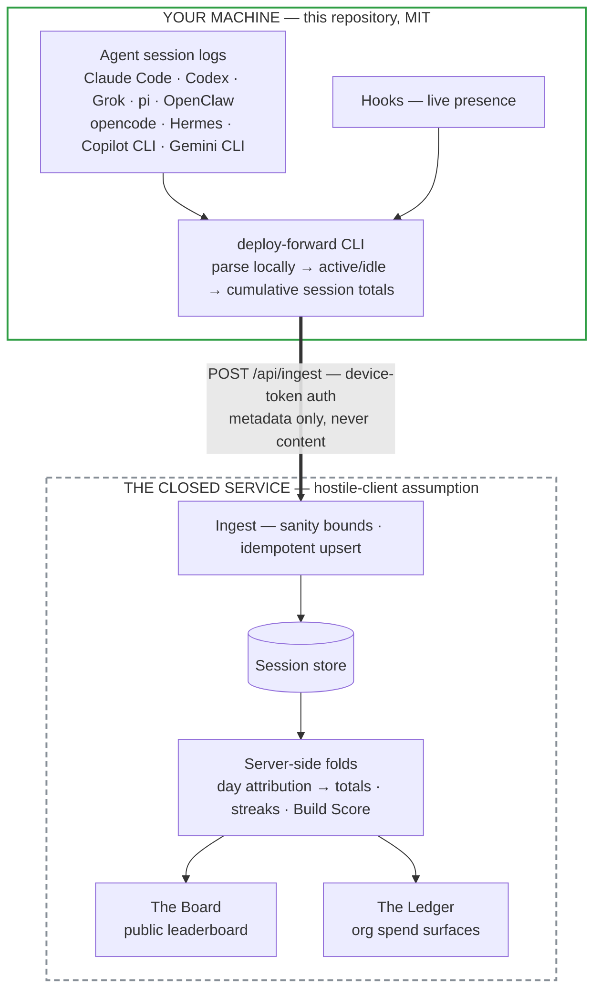

# Deploy Forward — the open capture layer

[](https://www.npmjs.com/package/deploy-forward)
[](./LICENSE)
[](https://github.com/Deploy-Forward/Deploy-Forward/actions/workflows/ci.yml)

The tracker, the usage core, and the capture contract behind
[Deploy Forward](https://deployforward.dev): one view of your AI-agent usage across
every model and every harness, and — when you opt in — the public
[Board](https://leaderboard.deployforward.dev).

**View it live: https://deployforward.dev**

Same data, your choice of surface:

- `npx --yes deploy-forward@latest usage` — the CLI: per-model table, real
  remaining-usage bars for every vendor-reported limit lane
- `npx --yes deploy-forward@latest serve` — the same view as a local web page
  at `127.0.0.1:4780` (loopback only, nothing leaves your machine)

Both render the same fold and the same limit lanes from one shared seam, so
they can never disagree.



## What's in this repository

| Directory | What it is |
| --- | --- |
| [`tracker/`](./tracker/) | The `deploy-forward` npm CLI: nine harness adapters, hooks integration, the local usage/spend view, sync. Start at its [README](./tracker/README.md). |
| [`usage-core/`](./usage-core/) | The canonical pricing table, tier bands, context windows, and spend math — dated, provenance-commented, versioned. |
| [`contract/`](./contract/) | The capture standard: the [wire schema](./contract/wire.schema.json), [wire semantics](./contract/WIRE.md), [privacy guarantees](./contract/PRIVACY.md), and the [harness registry + adapter contract](./contract/REGISTRY.md). |

## The boundary

> If it runs on your machine and captures or labels usage, it is **open** — this
> repository, MIT. If it ranks, folds, attributes, alerts, or serves an org surface, it
> is the **closed service**. The seam is the capture contract: counts only, labeled
> verifiability, explicit consent.

The server assumes a hostile client, so publishing the client costs the service
nothing — and buys you auditability: you can read exactly what leaves your machine
(spoiler: token counts, timestamps, model names, durations, and a local repo hash;
never your prompts, code, or file names).

## Why this exists

Agentic engineering is a value signal. Tokens routed through a harness and turned into
shipped outcomes are evidence of productivity — most engineers just have no instrument
for it. This is that instrument, and the numbers it reports are checkable: run it,
audit it, fork it. A number you cannot check is a number you should not report.

## How it works



The bold arrow is the seam, and it is the entire interface: one authenticated POST
carrying counts and timestamps. Everything inside the green box is this repository;
everything in the dashed box is the closed service, which treats every submission as
untrusted input (see [`contract/WIRE.md`](./contract/WIRE.md)).

Eleven tool ids are accepted by the service (the wire schema's `tool` enum):
`claude_code`, `codex`, `grok`, `cursor`, `vscode`, `pi`, `openclaw`, `opencode`,
`hermes`, `copilot`, `gemini` — an unrecognized id is never trusted raw. Local
adapters live one per harness in `tracker/src/` (`codex.ts`, `grok.ts`, `pi.ts`,
`openclaw.ts`, `opencode.ts`, `hermes.ts`, `copilot.ts`, `gemini.ts`), with Claude
Code handled by `jsonl.ts`. Cursor has no local adapter: its lane imports the
vendor's own account export, because local Cursor token data is unreliable.
`vscode` is a time-only signal from a separate extension.

## Build Score, and why spending can't buy it

The Board's live ranking is a four-axis counterbalanced composite (the full
methodology is published on the Board itself):

| Axis | What it measures |
| --- | --- |
| deployments | Shipped work, outcome-gated: merged PR >> opened PR > commit. |
| efficiency | Deployments per unit input. Tokens and sessions appear ONLY here, in the denominator. |
| quality | PR merge ratio plus a small review signal. Spamming junk PRs lowers it. |
| consistency | Sustained building (streak and active days), saturating. |

Each axis saturates through a cohort-free curve, so a score is meaningful from your
first session. The anti-tokenmaxxing property is structural, not a policy: volume
only ever sits in a denominator, so spending more can only lower a score. The
scoring math itself is server-side and deliberately not in this repository — the
boundary rule above.

## Integrity

The server assumes a hostile client. Submissions pass sanity bounds (active time can
never exceed wall-clock, token rates and daily totals have plausibility ceilings,
sessions can't roll back), upserts are idempotent so no duplicate inflates a total,
implausible sessions are flagged and excluded from ranking without being mutated,
and one GitHub identity maps to one verified account through a transactional lock.
Trust is a ladder (`self_reported` → `device_verified` → `otel_verified` →
`github_verified`) that only server-side proof can climb — the wire cannot assert
it. Exact thresholds are intentionally unpublished; the dispositions and semantics
are in [`contract/WIRE.md`](./contract/WIRE.md).

## Develop

```sh
cd tracker
npm install
npm run typecheck
npm test            # node --test via tsx; hermetic (DF_* home overrides, temp dirs)
npm run dev         # run the CLI straight from source (tsx bin/df.ts), no build step
npx tsx --test test/usageView.test.ts   # one suite while iterating
```

Point a local build at any server with `DF_API_BASE` (and `DF_APP_BASE` for printed
links); no account is needed for `npm run dev usage` or, after `npm run build`,
`node dist/bin/df.js usage`.

To change a model rate, tier band, or context window: edit `usage-core/src/`, run
`node usage-core/sync.mjs`, and commit what it touched — never edit a `src/core/`
copy (the coreParity test and CI's sync-parity guard both fail on drift; the full
procedure is in [`usage-core/README.md`](./usage-core/README.md)).
The CI in this repo runs the same commands plus two guards: the transcript tripwire
(`scripts/check-no-transcripts.mjs` — no real usage data can ever enter this tree)
and usage-core sync parity.

## Registries

npmjs is the front door: `npx --yes deploy-forward@latest`. The same package is
mirror-published to GitHub Packages as `@deploy-forward/deploy-forward`
(owner-scoped, as that registry requires). GitHub Packages needs a token with
`read:packages` even for public installs — if you want it anyway:

```sh
echo "@deploy-forward:registry=https://npm.pkg.github.com" >> ~/.npmrc
npm install @deploy-forward/deploy-forward
```

## Live rates

[`data/observed-rates.json`](./data/observed-rates.json) is rebuilt and committed
daily by the price-drift workflow: every canonical rate observed against two
independent public sources (LiteLLM, models.dev), with per-row agreement labels
and fetch timestamps. The canonical table stays hand-verified against vendor
pages; this artifact is the automated freshness layer on top — source-attributed
by construction, never silently promoted.

## Contributing

See [CONTRIBUTING.md](./CONTRIBUTING.md) (DCO, tests, the adapter contract). Security
reports: [SECURITY.md](./SECURITY.md).

MIT licensed. "Deploy Forward" the name and the hosted service are not part of the
license grant.
